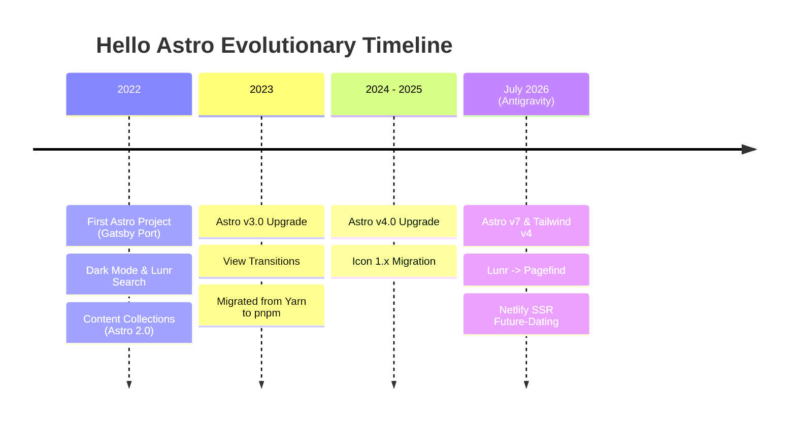

Our base template, [hello-astro](https://github.com/hellotham/hello-astro) (deployed at [hellotham.github.io/hello-astro/](https://hellotham.github.io/hello-astro/)), remains the core base template for the **Hello Tham website**. Today, it has grown to be starred **194 times** and forked **58 times** on GitHub.

Looking back at the git log, this project represents my personal learning journey transitioning to Astro after years of building sites in Gatsby and Next.js. Here is the story of how it evolved from my first Astro experiment to a modern server-side rendered application.

---

### Part 1: The Hand-Coded Learning Journey (2022–2025)

Before July 2026, every single commit was coded by hand as I learned the ins and outs of the Astro ecosystem:

- **August 2022 (First Steps & Porting from Gatsby):** Having previously learnt Gatsby and Next.js, this was my first project coding in Astro. I began by porting the essential layout and pages from our legacy `hello-gatsby-starter`. I had to learn how Astro’s components, named slots, static generation, and scoped style models differed from React-based frameworks. I hand-coded our initial SEO tags, dark mode switch, and RSS feed.
- **Late 2022 (Astro Collections & RPN calculator):** As Astro matured, I expanded the project by implementing Astro Content Collections (introduced in Astro 2.0). I integrated PhotoSwipe for galleries, Leaflet for maps, and minified Lunr search indexes.
- **2023 (View Transitions & Astro 3.0):** Experimented with Astro's new `ViewTransitions` API (introduced in Astro 2.9/3.0) to enable smooth page transitions, integrated Markdoc, migrated from Yarn to `pnpm`, and refactored the project for Astro v3.0.
- **2024–2025 (Maintenance & Astro 4.0):** Maintained the packages, resolved TS type errors, and migrated to `astro-icon` v1.x and Astro v4.x.

---

### Part 2: The Antigravity Partner Programming Era (July 2026)

In July 2026, after years of manual development, I partnered with **Antigravity** (a powerful agentic AI coding assistant designed by the Google Deepmind team) to perform a massive architectural overhaul:

- **Astro v7 & Tailwind CSS v4:** Upgraded our core compiler engines and migrated our style systems to Tailwind CSS v4, fixing search modal backdrop opacities.
- **Modern Search Engine:** Fully migrated the search architecture from Lunr and Alpine.js to **Pagefind**, enabling highly performant local search indexing.
- **Dynamic Future-Dating (SSR):** Reconfigured the site's dynamic routes to run on Server-Side Rendering (SSR) via `@astrojs/netlify`. Dynamic routes (`/`, `/blog`, `/rss.xml`, category/tag/author pages) now run on-demand to check the system date at request-time, ensuring future-dated posts are hidden until release.
- **Modern tooling:** Rebuilt our linter configuration to leverage flat ESLint configs (`eslint.config.mjs`) and Prettier (`.prettierrc.mjs`).

---

### 📋 Full Change Log & Project Milestones

This learning journey began as a simple experiment to explore a new static site generator and has evolved into a popular open-source template. Powered by the clean foundations of manual development and the latest agentic capabilities of Antigravity, `hello-astro` continues to serve as the high-performance base of our web presence.
