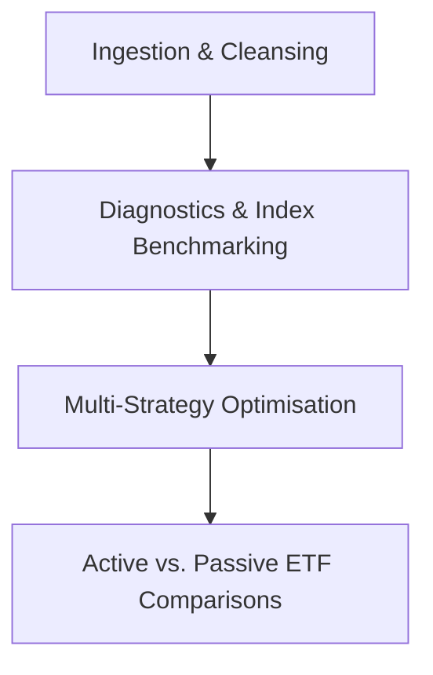

In [Part 2](/blog/2026-07-22-challenges-of-building-a-portfolio-optimiser/) of this series, we discussed the software engineering challenges of setting up price feeds, consolidating transactions, and working with modern "reloaded" quantitative packages.

Moving from infrastructure to execution, I designed a quantitative analysis and portfolio rebalancing pipeline in Python. Rather than focusing on individual files, this article outlines the modular approach I took to manage, benchmark, and optimize my investment portfolio, including the challenges of data accuracy.

---

## The Data Engineering Challenge: Sourcing ETF Distributions

One of the biggest hurdles I faced when constructing total return histories was a limitation in **`yfinance`**. While it retrieves stock dividends reliably, it frequently fails to return distribution data for Australian Exchange Traded Funds (ETFs) like Vanguard's `VAS.AX` or BetaShares' `VHY.AX`.

Because ETFs distribute capital gains, franking credits, and underlying dividends, ignoring these distributions significantly understates historical returns. To solve this, I had to:

1.  Manually download historical distribution tables (dates and cents-per-unit payouts) directly from the ETF providers' portals.
2.  Maintain a local database of these distributions.
3.  Inject the distribution schedules into the daily price arrays to calculate true, distribution-adjusted daily returns.

Here is a simplified view of how I aligned these manual schedules:

```python
import pandas as pd
import numpy as np

# Load manual ETF distributions database
dist_df = pd.read_csv('distributions/etf_distributions.csv', parse_dates=['ExDate'])

def calculate_total_returns(prices_df, distributions_df):
    returns_df = prices_df.pct_change()

    # Calculate yield on ex-dividend dates and add to capital return
    for symbol in prices_df.columns:
        sym_dists = distributions_df[distributions_df['Symbol'] == symbol]
        for _, row in sym_dists.iterrows():
            ex_date = row['ExDate']
            if ex_date in returns_df.index:
                price_on_date = prices_df.loc[ex_date, symbol]
                dist_yield = row['CentsPerUnit'] / (price_on_date * 100)
                returns_df.loc[ex_date, symbol] += dist_yield

    return returns_df.dropna()
```

---

## Core Quantitative Pipeline Stages

My overall rebalancing and optimization system is structured into four main pipeline stages.



### 1. Ingestion & Holdings Cleansing

The pipeline begins by loading transaction ledgers from different brokerages and accounting tools. The ingestion script consolidates buy and sell transactions, handles corporate adjustments (splits and mergers), and calculates the exact holding balance and cost base for each asset. The output is a single, clean portfolio weights profile.

### 2. Diagnostics, Sector mapping, & Benchmarking

Once holdings are consolidated, the pipeline maps each asset to its sector and industry classes to generate allocation visualizations.

To determine if the portfolio successfully generates excess returns, the daily returns are benchmarked against standard Australian market indices, including the All Ordinaries Index (`^AORD`) and the iShares S&P/ASX 20 ETF (`ILC.AX`). Using **`QuantStats`** (`qs.reports.full`) and **`PyFolio`**, the pipeline generates full performance tearsheets analyzing:

- _Sharpe, Sortino, and Calmar ratios_
- _Maximum drawdown depth and duration_
- _Rolling beta and volatility profiles_

### 3. Multi-Strategy Optimization

Using **`PyPortfolioOpt`**, the pipeline evaluates and compares three distinct allocation models to determine optimal rebalancing weights:

#### A. Mean-Variance Optimization (MVO)

Computes Expected Returns using an Exponential Moving Average (EMA) and estimates risk using Ledoit-Wolf shrinkage to reduce noise in the covariance matrix:

```python
from pypfopt import expected_returns, risk_models, EfficientFrontier

# Compute annualised estimators
mu = expected_returns.ema_historical_return(prices)
S = risk_models.CovarianceShrinkage(prices).ledoit_wolf()

# Optimise for Maximum Sharpe Ratio with weight bounds (max 15% per asset)
ef = EfficientFrontier(mu, S, weight_bounds=(0.0, 0.15))
weights = ef.max_sharpe(risk_free_rate=0.015)
```

#### B. Downside Risk Minimisation (Efficient Semivariance)

Traditional MVO treats all volatility the same. In practice, investors only care about downside volatility (losses). Using the `EfficientSemivariance` module, the pipeline optimizes allocations by minimizing downside semivariance:

$$ES(\mathbf{w}) = \frac{1}{T}\sum_{t=1}^{T} \min(0, \mathbf{w}^T\mathbf{r}_t - \mu_{\text{target}})^2$$

#### C. Hierarchical Risk Parity (HRP)

HRP uses machine learning to cluster assets based on their correlation matrix, building a tree structure (dendrogram). It then allocates weights to distribute risk equally across these clusters, bypassing the need to estimate expected returns or invert a covariance matrix.

### 4. Active vs. Passive ETF Comparison

Finally, the pipeline benchmarks the active portfolio against a baseline basket of property, equity, and high-income ETFs. By evaluating rolling alpha and beta parameters, this stage verifies whether active portfolio rebalancing successfully outperforms a set of simple, passive, buy-and-hold index funds.

---

## References

1. de Prado, M. L. (2016). "Building portfolios with Hierarchical Risk Parity." _The Journal of Portfolio Management_, 42(4), 59-69. [doi:10.3905/jpm.2016.42.4.059](https://doi.org/10.3905/jpm.2016.42.4.059)
2. QuantStats Documentation. "Portfolio analytics in Python." [https://github.com/ranaroussi/quantstats](https://github.com/ranaroussi/quantstats)
3. PyPortfolioOpt Documentation. "Mean-Variance and Semivariance Optimization." [https://pyportfolioopt.readthedocs.io/en/latest/](https://pyportfolioopt.readthedocs.io/en/latest/)
