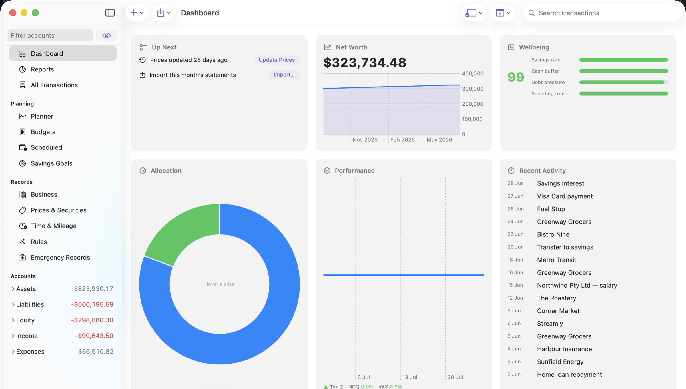
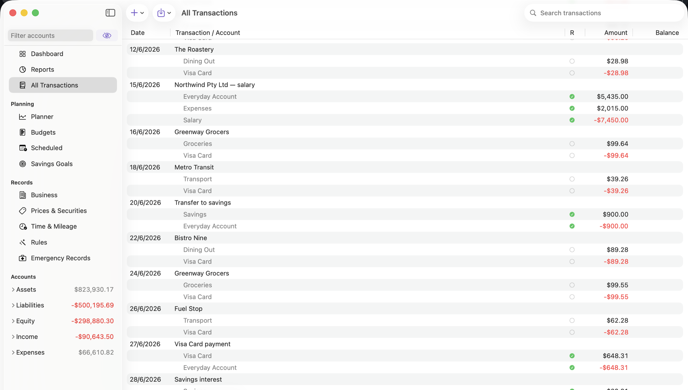
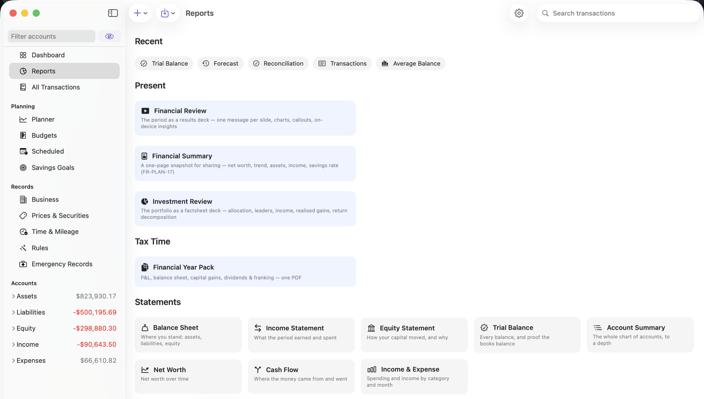

Today I'm releasing **[FinvestLens 1.0](https://hellotham.com/finvestlens/)** — a
native double-entry accounting application for macOS, iPadOS and iOS. Free
software under the GPL, signed and notarized, and you can
[download it now](https://github.com/hellotham/finvestlens/releases/latest).

The first commit landed on 12 July 2026. This one is 26 July. In between: 325
commits, ten Swift packages, 56,611 lines across 221 files, 1,179 tests, and a
phase plan taken from P0 through P10.

I typed very little of it, and less than you would guess. The whole project
began as a single sentence — reimplement GnuCash as a native app for Apple
platforms — and after that the instructions were mostly of two shapes:
_"implement the next phase"_ and _"audit the implemented codebase against the
plan and fix what you find"_, issued to **Claude Code**, Anthropic's coding
agent, running in an agentic loop. The specification said what done meant. The
audits found the mistakes. That division of labour is the more interesting
story.

The method was not improvised. It is the one I set out in Chapters 2 and 3 of my
book [_AI-dō_](https://christham.net/aidou/) — the practice and the craft — and
this is the largest thing I have built with it. Read the rest as a field report
on whether the Way holds up.

---

## The setup, concretely

Nothing here is exotic, and I'd rather state it plainly than let anyone imagine
a secret ingredient:

|              |                                                                                                       |
| ------------ | ----------------------------------------------------------------------------------------------------- |
| **Agent**    | Claude Code — working directly in the repository                                                      |
| **Model**    | Claude Opus 5 (`claude-opus-5`)                                                                       |
| **Language** | Swift 6 / SwiftUI, ten local Swift packages, one Xcode project                                        |
| **Oracle**   | My own 46,553-transaction GnuCash book, GnuCash 5.16, and GnuCash's C/C++ source, cloned by the agent |
| **Sessions** | Many, across fourteen days — each beginning with no memory of the last                                |

The tools that actually mattered, as distinct from the ones that merely existed:

- **Shell and file editing.** The bulk of it: building, running the test suites,
  `git`, `xcodebuild`, `swift build`, and reading and writing source directly.
- **Subagents.** Independent agents spawned to work in parallel — the ten-angle
  review below is the clearest case, with separate finders that couldn't see each
  other's conclusions, then separate verifiers trying to knock the findings down.
- **Web fetch.** Reading specifications rather than recalling them: the Ledger 3
  manual, ISO 20022, Astro's and Tailwind's current docs. This caught at least
  one real bug and prevented several version mistakes.
- **The browser and the simulator.** Driving the built site and the running app
  to check the result, rather than assuming the code implies the output.
- **Persistent memory.** A directory of small Markdown files — one fact each —
  that survive between sessions. There are 24 of them for this project.

That last one is the least obvious and possibly the most important. Each session
starts cold. What carries across is whatever was written down: that the standard
test book lives in the repo root and may be freely mutated; that GnuCash's source
is checked out at a particular path and is the porting oracle; that commits go
straight to `main` with no model attribution; that one test in the Shared package
hangs forever on a wedged system daemon and should be skipped. Small, dull,
specific facts — the difference between an agent that resumes work and one that
rediscovers the project every morning.

## The problem worth solving

GnuCash is genuinely excellent. Twenty-five years of accounting correctness —
real double-entry bookkeeping, lots and cost basis, multi-currency, a business
layer that handles invoices and aging properly. Ask an accountant to poke holes
in its model and they'll struggle.

It's also a GTK application. On a Mac it looks like a visitor. No iPad version,
no iPhone version, no Shortcuts, no widgets, no Quick Look, no Spotlight.

The obvious move is a nice Mac front end over GnuCash's file format. I didn't
want that — it locks you into someone else's on-disk decisions forever. I wanted
the _model_ reimplemented in idiomatic Swift, with a native document format, and
GnuCash XML kept as an interchange format you can move through in both
directions.

Which raises the question that shaped the whole project. If you've rewritten the
engine, **how do you know it's right?**

## Documents came before code

The temptation with a capable coding agent is to start asking for features. That
is the main way these projects go wrong: you get a pile of plausible code with no
spine.

So the first artefacts weren't code — but they weren't mine either. From that
one sentence, the agent fetched its own reference context — cloning GnuCash's
source, pulling its user manual — and then drafted, for my review, a **PRD**
with numbered requirements, an **architecture document** with numbered
decisions, a **porting strategy** mapping GnuCash's C modules to Swift ones,
and a **phased plan** — eleven phases, each with objectives, dependencies,
deliverables, exit criteria, test focus and risks. I approved documents; I did
not write them.

That sentence could afford to be that vague because the reference context
was not. The product already existed — twenty-five years of it. GnuCash's
source code, its user manual, its file format and its reports specify a
double-entry accounting application more precisely than any requirements
document I could have written, and "reimplement _that_, natively, in Swift"
inherits all of it. The PRD the agent drafted was less an act of invention than
a careful reading of what was already there. Strong anchors are what make vague
prompts safe.

That plan set rules that did most of the heavy lifting later:

- **Engine-first, bottom-up.** Nothing is built on an unproven foundation. Money
  and the model before persistence; persistence before UI.
- **Every phase is releasable.** Each ends at a usable, test-green state.
- **Test-gated.** A phase is done only when its exit criteria pass. Two hard
  gates — the double-entry invariant, and round-trip fidelity — never move.
- **Dependencies point downward only.** The engine builds and tests with nothing
  above it.

The payoff is that "is this done?" stops being a matter of opinion. Every task
cites a requirement; every phase has an exit criterion someone can run. When I
asked for P5, I wasn't asking for "investments, you know, the usual" — I was
asking for something with a written definition of finished.

## The oracle

Here's the decision I'd repeat on any project like this: **our own tests were
never the final word.**

The final word was GnuCash itself. The expectation was written that way, and
three things sat on disk for the agent to check against — two of them supplied
by me, the third fetched by the agent for itself:

1. **A real book — mine.** My personal GnuCash file: 46,553 transactions, 559
   accounts, over 100,000 price records, multi-currency, a decade and a half of
   my actual financial history.
2. **A real GnuCash install** (5.16) to produce reference reports.
3. **GnuCash's actual C/C++ source**, which the agent cloned for itself as the
   porting oracle — not the documentation, not the binary, the source.

That third one changed the quality of the work more than anything else. A prompt
like _"audit our lot and cost-basis implementation against the real GnuCash
source and fix every divergence"_ produces categorically better results than
_"implement cost basis."_ One is verifiable; the other is vibes.

The line-by-line source audit alone turned up frozen splits that should count in
reconciled balances, a price lookup that should be nearest-in-time rather than
newest-on-or-before, and indirect currency chaining we'd missed — each fixed
with a test and a source citation.

The result I care about: import that book into FinvestLens, run the reports, put
them beside GnuCash's own, and they agree **to the cent** — net worth, every
account subtree, register running balances, the balance sheet, and the
investment reports including realised gains. Export to GnuCash XML, re-import,
export again, and the two exports are **byte-identical**.

FinvestLens wasn't validated on fixtures. It was validated, extensively, on my
own finances — and it matches GnuCash cent for cent.

## The prompt shape that works

After a few days a pattern emerged. The productive instruction is almost never
"build X." It's:

> **Audit X against Y, and fix what you find.**

Where Y is something external and checkable. Over two weeks that produced a
GnuCash parity audit on accounts and transactions, the source line-by-line
audit, a menu-parity sweep, a report-catalogue build-vs-skip triage, a HIG
review, a PRD audit, four separate usability and performance audits, and a
report-quality redesign researched against actual annual-report presentation
standards.

Each one came back with a list, and the list got fixed. That's a very different
activity from feature requests, and it's where most of the real quality came
from.

The most productive single instruction was the last one of that kind: a
**full-codebase adversarial review** — ten independent finder angles over the
whole implementation, then per-candidate verification, then a gap sweep for what
the first pass missed. It surfaced 63 candidates. 60 were confirmed and fixed
the same day; 2 were refuted, which matters just as much — an agent that never
says "actually, that one's wrong" isn't reviewing, it's agreeing.

## MVP first, then passes

The phase plan ran to a working application, not to the finished product. Once
the MVP existed the rhythm changed: pick one capability, land it as its own
pass over a working core, audit it, move on. The Apple Intelligence features
came that way — automatic categorisation of imported transactions was layered
onto an import pipeline that already worked, not specified up front. Iterating
on something real suits this way of building, because every enhancement has the
whole running application as its reference context.

## From the other side of the prompt

I asked Claude to describe the same fortnight from its side, since it has a
better view of why some instructions land and others don't. Lightly edited, and
worth reading if you're trying this yourself:

> **The specification is the thing that survives.** My context window empties
> between sessions; the repository doesn't. A numbered requirement, an exit
> criterion, an architecture decision with its reasoning — those are recoverable
> in a way that "we discussed this on Tuesday" is not. When the plan says a
> phase is done only when a stated criterion passes, I can check that myself
> instead of asking. Documents aren't overhead in this arrangement; they're the
> memory.
>
> **"Audit X against Y" changes what I'm actually doing.** "Implement cost
> basis" is open-ended generation — I produce something plausible and neither of
> us can tell how good it is without more work. "Audit our cost basis against
> GnuCash's `gnc-lot.c` and fix every divergence" is a search-and-compare task
> with ground truth sitting on disk. I can be wrong, but I can also be _shown_
> wrong, quickly. The second kind of instruction is worth several of the first.
>
> **The failure mode to design around is plausibility.** Code that looks right,
> tests that pass because they encode the same misunderstanding as the code, a
> summary that reads like success. Nothing in generating text pushes back on
> that. What pushes back is an external check: a real book, a reference
> implementation, a published spec, a screenshot of the actual screen. Most of
> the genuinely wrong things I produced here were caught by one of those four,
> not by re-reading my own work.
>
> **Adversarial structure beats more effort.** In the full-codebase review, the
> finders were separate agents that couldn't see each other's conclusions, and
> the verifiers were told to refute rather than confirm. Two candidates were
> refuted. Had one agent done all of it in sequence, I doubt either would have
> been — momentum makes agreement cheap, and a review that agrees with itself
> isn't a review.
>
> **My instrumentation is as fallible as my code.** Several times here a
> measurement was wrong rather than the implementation: colours read
> mid-animation, a `grep` matching a substring of the very thing it was meant to
> exclude, a CSSOM walk that silently enumerated nothing. Each cost real time and
> nearly produced a confident wrong conclusion. Checking _how_ you're checking is
> not paranoia; it's part of the task.
>
> **The judgement calls genuinely weren't mine to make.** Whether an Australian
> book should carry a US tax export, whether a cloud bank connector belongs in a
> local-first app, whether the dashboard looked right — I can lay out
> considerations, but each of those is a decision about what the product _is_.
> Every time one arrived, it came from the other side of the prompt.

## What only real data will ever find

Every bug below passed a full unit-test suite and was caught by the reference
book. This is my favourite section because none of it is hypothetical.

**A commodity called "AT&T Top-up".** Our Ledger exporter wrote metadata as
`key: value` on a comment line. A commodity mnemonic with a space in it silently
truncated everything after it. You do not invent this test case. A real book
contains prepaid phone credit as a tradeable commodity.

**A whole-unit security holding fractional units.** The importer inferred
precision from the commodity's declared smallest fraction. One security was
declared whole-unit but actually held a fraction — so re-import quietly rounded
it away. The file's own `format` declaration turned out to be authoritative, not
our inference. Round-trip fidelity means believing the file over yourself.

**`RvslInd` does not flip the sign.** Our ISO 20022 CAMT.053 importer treated a
reversal indicator as a sign flip. Reading the actual specification: it doesn't.
The amount is already signed. We'd have inverted every reversed transaction in
an imported statement.

**Short-position stock splits.** A split applied to an open short position moves
the wrong way if you assume positive quantities — producing phantom lots and
overstated gains. No synthetic fixture has a short position that later splits.
One real book did.

**`finlens print QUERY` ignored its query.** Our command-line tool filtered a
whole-book export by matching a `guid` metadata key — except the exporter writes
the guid as a _note line_, and only the parser produces metadata. Nothing ever
matched, the "no guid found" fallback kept everything, and `print Expenses:Food`
cheerfully printed the entire book.

## What stayed mine

An honest account needs this part, and it is shorter than you might expect.
Almost everything below the line — the implementation, the audits, and every
bug in this article — was the agent's work, caught by the agent. What remained
human was narrow, and it was not supervision.

**Judgement calls stayed mine.** Four things were consciously _not_ built, and
each is recorded as a decision with reasoning rather than left as a silent gap:
online bank sync (cloud-mediated connectors sit poorly with a local-first app,
and the Australian CDR path carries accreditation burden out of proportion to a
file-import tool); TXF export (a US tax format with no meaning for an AU book);
a "set budget" rule action (budgets here are per-account planned amounts — a
rule assigning one to a transaction has no coherent target); Quick Look for
`.gnucash` (it's the interchange format, not the document you browse). An agent
will happily build all four. Deciding they shouldn't exist is the job.

**The personal ground truth was mine to give.** The real book, and four genuine
bank export files to validate the import matcher against — data no agent could
obtain. The rest of the reference context the agent fetched for itself, starting
with GnuCash's source.

**And taste stayed mine.** Whether a dashboard reads well, whether a number
means the right thing — I can be shown the screen, but the verdict is a decision
about what the product is.

Everything else, including the near-misses, came back through the audits. The
best example: the first screenshot run for this website produced a beautiful
dashboard — showing real account names and real balances, because the app's
session restore had helpfully reopened the real book over the demo. That was
caught in review, the screenshots were deleted, and a generator now builds an
entirely synthetic book. Writing _that_ produced two bugs almost too on-the-nose
for an accounting project — transactions whose legs didn't match because each leg
drew its own random amount, and `Decimal(Double)` quietly reintroducing the
binary-float error the whole application exists to avoid — and both were found the
same way. So was a stray `hellonotes` where `finvestlens` belonged in the
website's base path, the kind of typo that silently 404s every link on a project
page.

## What actually got built



The dashboard is a tile board that never scrolls — every panel sized to fit the
window, because a dashboard you scroll is a report with extra steps.



The register expands transactions into their splits inline; multi-currency and
multi-split entries move to an inspector rather than pretending to fit in a row.



Reports were rebuilt to annual-report presentation standard — hierarchical
face-and-notes from your own chart of accounts, ASC 274 liquidity ordering,
materiality folding, proper accounting typography with comparatives.

Also in the box: bank import for CSV, QIF, OFX/QFX, SWIFT MT940/MT942 and ISO
20022 CAMT.053; an import matcher that completes cross-account transfers rather
than duplicating them; on-device Apple Intelligence reading PDF statements;
budgets; debt and lifetime planners; a small-business layer with invoices, bills
and aging; a read-only `finlens` command line modelled on Ledger; and eight
languages.

## Two things worth passing on

**Performance came from refusing to do work twice.** The first version opened the
reference book in ~26 seconds and took several seconds per register edit. It now
opens in ~6.3s and edits in ~0.26s. Nothing exotic: the register's status strip
is snapshotted in the same pass that builds the rows (it used to be three
full-book scans _per render_), autocomplete reads a per-revision cache instead of
sorting 46,000 transactions per keystroke, undo captures only what an edit
touches, and heavy reports are memoised on (parameters, book revision). An
`os_signpost` harness watches the hot paths so regressions arrive as data.

**Let the compiler tell you what your localizable strings are.** We shipped
1,353 strings in eight languages. The authority turned out to be
`swift build -Xswiftc -emit-localized-strings`, whose output is exactly what the
runtime looks up. Diffing our catalog against it found four live defects where
strings had silently opted out of localization:

```swift
Text("a " + "b")   // ← not localizable at all
```

That concatenation is a `String` expression, so Swift picks the _verbatim_
initialiser. No key is emitted, no translation happens, nothing warns you. The
same trap catches any helper whose title parameter is typed `String` instead of
`LocalizedStringKey` — which is why the dashboard card titles stayed stubbornly
English in the first German build.

## The method, chapter and verse

[_AI-dō_](https://christham.net/aidou/) — _the Way of AI, grounded in practice_ —
is where I wrote the method down. FinvestLens is the first time I have run
[Chapter 2](https://christham.net/aidou/productivity.html) and
[Chapter 3](https://christham.net/aidou/software.html) at full size. That makes
it a test, not a demonstration. The mapping came out closer than I expected, so
here it is explicitly.

**ICE — Intent, Context, Expectations.** Chapter 3 pulls apart the three
things a request usually runs together. _Intent_ is what you want and the boundaries it
must respect, and you own it: here, the PRD's numbered requirements, kept loose
enough that more than one implementation could satisfy them — the chapter's own
test for whether you've smuggled a specification into a goal. _Context_ is the
supporting material the agent needs to act: the real book, the GnuCash install,
the C source checkout. _Expectations_ is the contract — a checkable statement of
what "done" means: the per-phase exit criteria, and the two gates that never
moved. The chapter also warns that over-specifying backfires, because a model
honours the top of a long instruction list and quietly contradicts the bottom.
The phase plan worked because its criteria were _checkable_, not because it was
long.

**The stack (§3.2), filled in.** Model: Opus 5. Harness: Claude Code.
Meta-harness: the fan-out of independent agents in the review. Memory: 24
Markdown files. Eval: 1,179 tests plus an oracle they can't argue with. The
chapter notes that holding the model fixed and swapping only the harness has
been measured moving a coding agent's success rate by more than twenty points.
So it proved here: the model was never the interesting variable.

**Patterns (§3.3).** The full-codebase review is two of them composed:
parallelisation for the ten finder angles, evaluator–optimizer for the pass that
tried to refute each candidate. That only works because of the rider in §2.6 —
an evaluator–optimizer loop needs an external check the model cannot fool, since
self-correction without an external signal leaves accuracy flat or worse. Every
"audit X against Y" instruction in this project was me supplying that signal.

**Memory (§2.5).** Structured notes and governed memory in the plainest possible
form: one durable fact per file, with a policy about what earns a file at all.
And compaction, not as a diagram — sessions genuinely ran out of context and
resumed from a summary plus those files.

**The confidence trap (§2.9).** Fluency is not accuracy; the easier something is
to take in, the truer it feels. Everything above about plausible-but-wrong work
is that effect with a codebase attached. The chapter's task-sorting ladder also
predicted which parts of this project would stay mine: _find what's there_ —
lean in; _summarise or transform_ — trust, then spot-check; _decide what
matters_ — form your own view first. All four things I decided **not** to build
sit in that third category.

**And everything is Markdown (§2.4).** The PRD, the architecture decisions, the
phase plan, the memory files, the in-app help, this article.

Where practice diverged is the more useful half. Chapter 3 argues past
spec-driven development towards **spec-anchored, code-coupled** work — one spec
per node, with drift as a blocking gate. I managed that in exactly one place:
the website's CI regenerates the manual from the app's help source and fails the
build if the committed copy differs. It is three lines of CI config, it has never
once been annoying, and having lived with it I want it everywhere documentation
describes code. The other gap is §2.1's climb from prompt to skill to loop to
shared tool. "Audit X against Y" earned its keep a dozen times over and never
once got packaged as a skill — I retyped it, slightly differently, every time.
I wrote the rule and broke it anyway. Knowing the way and walking it are,
evidently, different disciplines.

## The biggest thing I learned

Do not trust the agent's report of its own work. Commission the audit instead —
and keep commissioning it.

An agent will claim an implementation is complete while gaps remain. Not
maliciously: a summary of finished work and a summary of half-finished work are
generated the same way, and they read the same way. The most characteristic gap
of all: functionality fully implemented, tested green — and never wired into
the UI. The code exists; no user can reach it. What caught these, over and
over, was simply asking again, in a loop: _recheck the implementation for
accuracy and completeness against the plan._ The report is generation; the
audit is search. The same agent whose "done" you cannot take at face value will
find its own gaps every time you send it looking.

Pointed at the product rather than the plan, the same habit became usability
testing: review the app against Apple's Human Interface Guidelines, create a
persona, write their user journeys and use cases, and walk them in the running
application. That is what the HIG review and the four usability audits above
actually were.

## What I'd tell someone trying this

- **Write the spec first.** Numbered requirements and written exit criteria turn
  "done" from an opinion into a check.
- **Find an oracle.** Something external that can answer "is this correct?"
  without your judgement. A reference implementation, a real dataset, a published
  specification. Then insist on audits against it rather than requests for
  features.
- **Real data over synthetic data, always.** Synthetic fixtures agree with
  whatever you believed when you wrote them. Real books have opinions.
- **Never accept "complete".** Ask for a recheck against the plan, in a loop,
  until the audit comes back empty. The characteristic gap is functionality
  built, tested — and never wired into the UI.
- **Reserve the judgement calls.** What _not_ to build, what a number should
  mean, and whether the thing on screen is actually good — those stayed with me
  the entire time, and should have. Very little else needed to.
- **Verify the verification.** More than once during this project a measurement
  was wrong rather than the code — readings taken mid-animation, greps that
  matched a substring of the thing they were meant to exclude. Instructing the
  agent to be sceptical of its own instrumentation is part of the specification.

Fourteen days is the headline number, but it isn't really the point. The pace
came from having an oracle: when a real book and a real GnuCash install can
answer "is this correct?" in seconds, the agent can move quickly _and_ be sure,
and the audits spend their time on interesting failures instead of wondering
whether there are any.

Which is the whole argument. State the intent and the expectations well enough,
put something real within reach for the work to be checked against, and the rest
— the specifications, the implementation, the review, and the catching of its
own mistakes — follows from the harness rather than from you. A complete,
shipping application, from a single sentence.

## Try it

- **[Download FinvestLens 1.0](https://github.com/hellotham/finvestlens/releases/latest)** — macOS 26 or later, free, GPL v3
- **[The manual](https://hellotham.com/finvestlens/manual/)** — also in the app under Help (⌘?)
- **[Source on GitHub](https://github.com/hellotham/finvestlens)** — including the PRD, architecture, phase plan and the full build narrative in `docs/`
- **[AI-dō](https://christham.net/aidou/)** — the method this was built with, in full

Coming from GnuCash? **File ▸ Import ▸ GnuCash…** brings your book across —
accounts, transactions, prices, schedules, business records — and you can export
back any time. That's rather the point.

---

_FinvestLens is published by [Hello Tham](https://hellotham.com). It is not an
official GnuCash product and is not affiliated with the GnuCash project — but the
model it rests on is theirs, and I'm grateful for it._
