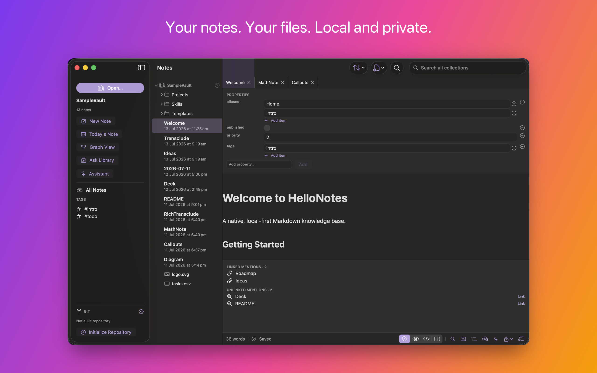
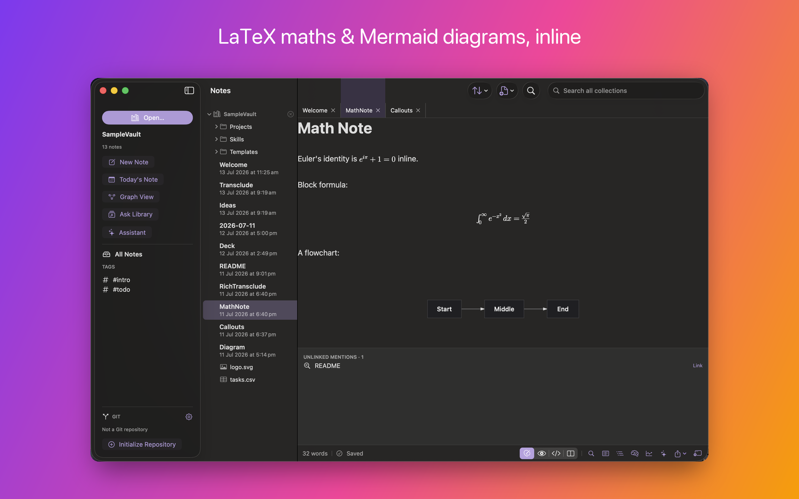
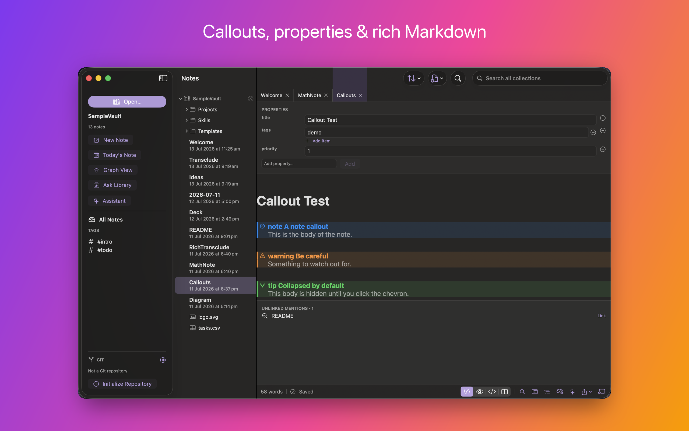
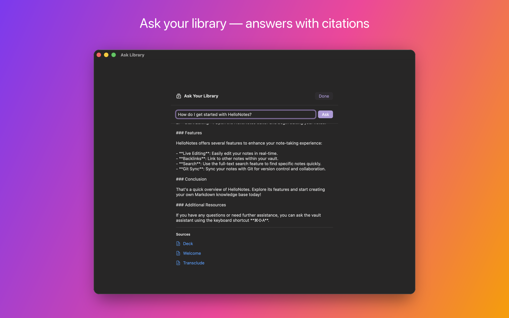
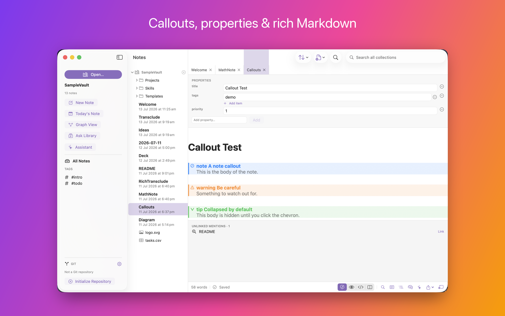

**HelloNotes 1.0 is out today.** It's free, signed and notarised by Apple, universal for Apple silicon and Intel, and it needs macOS 15 or later.

**[Download it](https://github.com/hellotham/hellonotes/releases/latest/download/HelloNotes.dmg)** · **[hellotham.com/hellonotes](https://hellotham.com/hellonotes/)** · **[Source](https://github.com/hellotham/hellonotes)**

---

## What it is

A knowledge base whose database is a folder.

Your notes are ordinary `.md` files somewhere you chose. There is no import step, no library format, no account, and no sync service of mine. If HelloNotes vanished tomorrow, every note would still open in any text editor on any platform — because they were never anything else.



On top of that folder you get the things that make a pile of files into a knowledge base: `[[wiki-links]]` with autocomplete and aliases, backlinks, unlinked mentions, transclusion, nested tags, full-text search, daily notes, templates, and a graph view. Plus Git version history, cloud-folder support, and on-device AI.

An existing **Obsidian vault opens as-is** — wiki-links, tags, aliases and front matter intact. There's nothing to convert, because there's nothing to convert _to_.

---

## The bet

Every Markdown tool asks you to give something up. Obsidian is powerful and local-first, but Electron — heavy, and never quite native in the way text handling on a Mac can be. Bear and Apple Notes are fast and beautifully native, but your notes live in an opaque database you can't `grep` or version. Typora is a lovely focused writing surface but is document-centric rather than a linked knowledge base. VS Code will happily edit Markdown, but it's a code editor wearing a writing hat.

Four things, and nothing had all of them:

1. Genuinely native performance and feel
2. Plain files on disk that you own
3. First-class Git sync
4. A linked knowledge graph — `[[wiki-links]]` and backlinks

My bet was that a knowledge tool built on **AppKit + TextKit 2 + SwiftUI** could deliver editing latency, scroll performance and OS integration that web-tech competitors structurally cannot — while keeping your data in an open, greppable format you fully own.

That bet is only interesting if the editor is genuinely good. Which is where most of the fifteen days went.

---

## The editor is the whole product

HelloNotes styles Markdown _as you type_. Headings grow, emphasis takes effect, tables align, callouts get their coloured band — while the file on disk stays exactly the Markdown you typed. Move the caret into a construct and its raw syntax appears so you can edit it; move away and it tidies itself again.



Maths and Mermaid diagrams render **natively** — no browser engine anywhere in the editor. Code blocks are syntax-highlighted across ~190 languages using GitHub's own theme. Callouts collapse. YAML front matter is hidden from the prose and shown as a typed, editable Properties panel instead of raw YAML.



Two design rules got it there, and they're the intellectual core of the whole project:

> **1. Raw Markdown _is_ the text storage.** One text, one coordinate system. Byte fidelity holds by construction, because presentation is only attributes and drawing — never text substitution.
>
> **2. Every editing-path operation is O(damage), never O(document).** Full-document passes happen exactly once, at open, off the main thread.

Concretely, on a 3.8 MB stress note: the initial parse is ~12 ms, the first screens style in ~48 ms, and a full keystroke cycle measures ~6 ms. Perf tests fail the build if a 1 MB parse exceeds 50 ms or a keystroke cycle exceeds 5 ms.

### I forked a Markdown engine, shipped eight patches, upstreamed five — then deleted all of it

The first editor was built on a fork of an open-source TextKit 2 Markdown engine. Eight features were blocked on missing engine hooks, so each became a patch on the fork and a focused upstream PR: scroll-to-location, inline Mermaid, find & replace, tag autocomplete, callouts, `%%comments%%`, front-matter hiding, transclusion.

It worked. It also _failed my own performance targets_ on large notes — scroll jank, freezes, caret lag. When I finally sat down and enumerated why, every cause turned out to be **structural rather than a bug**:

- Full-document AST re-tokenise on every edit, with a parse cache keyed by string equality — O(document) per keystroke _and_ per caret move.
- `ensureLayout(for: documentRange)` to position code-block overlays — O(document) layout. That was the freeze.
- Chrome implemented as overlay subviews, reconciled per scroll through `DispatchQueue.main.async`.
- Text passed as `Binding<String>` through SwiftUI — a whole-string copy and O(n) compare per keystroke.

You cannot patch your way out of an architecture. So I deleted the fork and had the editor rewritten from scratch as a greenfield package, in five milestones, ending with the fork gone from the dependency graph entirely. The patches are still published upstream; they were good patches. They were just holding up the wrong building.

---

## Proving it renders like GitHub (not "looks about right")

"GitHub-compatible Markdown" is the kind of claim everyone makes and nobody tests. I didn't ask for GitHub-compatible. I asked for **identical to the GitHub REST `POST /markdown` API** — and that one word, _identical_, changed the architecture.

The Preview renders through **cmark-gfm**, the same engine GitHub uses, into HTML shown in a WKWebView styled with github-markdown-css. (That's the one place a web view earns its keep: the whole point is to be byte-identical to GitHub, and GitHub renders HTML.) Two assertions hold it in place:

- **648/648** on the GFM specification's own `spec.txt` corpus (638 exact, plus 10 documented tagfilter and extended-autolink overrides that GitHub applies too).
- **Byte-identity** against a captured response from `api.github.com/markdown`, normalising only GitHub's own display post-processing.

Then the _live editor_ was moved onto that same cmark AST, so what you type looks like what you'd get: **340/340** inline constructs and **711/722** block classifications agree with cmark.

If a note looks right in HelloNotes, it looks right in a README.

---

## Your notes, connected


The graph view is a native `Canvas` force-directed layout — no web view, no D3 — with directional arrows and focus tracing to follow one thread through a collection. There's a content-based mind map for a single note's structure, and every note shows what links to it, what it links out to, and which notes mention it _without_ linking yet.

---

## Cloud storage, without a cloud

You can keep a collection in iCloud Drive, Dropbox, Box, OneDrive or Google Drive. Files stay online-only until you open them.

This one nearly didn't work at all, for a reason worth writing down: **the app used `NSFileCoordinator` nowhere.** Every read was `String(contentsOf:)`, every write `.write(to:.atomic)`. On a File Provider volume, reading an _online-only_ file that way can fail outright with `EDEADLK` — which meant cloud folders, **including iCloud**, were quietly unusable.

The fix was a coordinated-I/O layer and migrating every single vault read and write onto it — editor open and save, collection indexing, rename-with-link-rewrite, daily notes, search and link-graph indexing, image paste, export, agent tools. A second pass made indexing _dataless-aware_, so opening a cloud vault doesn't download all of it — the exact opposite of what you want. Verified against my real 2,019-note iCloud vault: no hangs, no `EDEADLK`.

---

## Intelligence that stays on your Mac



Ask a question in plain language and get an answer grounded in your own notes, with citations back to the source files. It runs on-device through Apple Intelligence by default. If you'd rather use your own model, there are adapters for MLX, OpenAI-compatible endpoints, Anthropic and Gemini — your key, your endpoint.

There's also an agentic assistant with tools gated behind an explicit permission broker, and per-note intelligence: summarise, suggest tags, suggest links.

---

## Light and dark, everywhere

Both the app and its website follow your Mac, or pin to one appearance:

| Light                                                                        | Dark                                                                       |
| ---------------------------------------------------------------------------- | -------------------------------------------------------------------------- |
|  |  |

---

## How this was actually built

I wrote very little of this code by hand. I built HelloNotes by prompting [Claude Code](https://claude.com/claude-code), and the git history is co-authored throughout.

It wasn't improvised, either. I published **[AI-dō — The Way of AI](https://christham.net/aidou/)** — a book arguing that working with AI is a discipline rather than a vibe — on **8 July**. The first commit in this repository is dated **11 July**. HelloNotes is the first thing I've built start-to-finish under a method I'd finished writing down three days earlier — specifically [Chapter 3, _Software Development (the craft)_](https://christham.net/aidou/software.html) and [Chapter 4, _Human and Agent Disciplines (the climb)_](https://christham.net/aidou/disciplines.html).

Here's what the job actually turned out to be.

## The prompt was "build me a Markdown editor that is folder/repository based"

Before any code existed, I asked Claude to generate three documents based on my initial vague intent:

- **`PRD.md`** — who it's for, the four-way gap in the market, what v1.0 must do.
- **`architecture.md`** — the layer model, and the rules (`@Observable` only, no CoreData, the folder is the source of truth).
- **`implementation-plan.md`** — a milestone sequence, M0 through M13.

The plan is the part that made this work. Each milestone wasn't a wish, it was a table — task, target file, and an **acceptance criterion**:

| #   | Task                                                         | File(s)                   | Acceptance                                                               |
| --- | ------------------------------------------------------------ | ------------------------- | ------------------------------------------------------------------------ |
| 1.2 | `EditorModel`: load text, dirty tracking, debounced autosave | `State/EditorModel.swift` | Edits hit disk ≤1s after typing stops; kill-mid-edit leaves file intact. |
| 1.7 | Persist vault via security-scoped bookmark                   | `WorkspaceIndexer.swift`  | Relaunch reopens the last vault automatically.                           |

And each milestone closed with a _done-when_ sentence in plain English — for M1: "open an existing folder of `.md` files, edit any note with live formatting and code highlighting, changes auto-persist, and new/deleted notes reflect on disk — all reopening cleanly on relaunch."

So my prompts were mostly **"do Milestone 3"**. The plan already said what done looked like, which file it lived in, and how I'd know.

Why this works is worth being exact about, because the book states it as a caution: _"A model is a next-token predictor, not a compiler: it does not execute a specification, it produces the most plausible continuation of everything in its context."_ A spec doesn't help by being run — nothing runs it. It helps by putting the definition of _right_ into that context before the work starts, so that afterwards there is something other than plausibility to judge the output against. Writing one was my highest-leverage work all fortnight.

(That plan has since been folded into [`implemented.md`](https://github.com/hellotham/hellonotes/blob/main/docs/implemented.md), which is the honest engineering log — milestones, fixes, and a lot of what _didn't_ work. It's still in git history if you want the original.)

## The gate: every milestone ends on a green build

Zero errors, zero warnings in app sources, plus tests where the plan called for them. No milestone was "done" on a description of the work — only on a build.

This has an unglamorous consequence: a cold build of this project takes **30 to 47 minutes**. Seventy-four targets, including MLX, libgit2 and swift-transformers. More than once Claude nearly killed a build it assumed had hung. Learning to sit through it — and writing "a long `xcodebuild` is a cold rebuild, not a hang" into Claude's notes so it would stop second-guessing — was a genuine part of the process.

## My actual job was refusing "deferred"

This is the thing I'd tell anyone building software this way.

The single most valuable thing I did was **say no to plausible-sounding excuses**. Twice, a hard TextKit 2 concealment bug came back to me as _"reverted — this is cosmetic."_ It was not cosmetic. Concealing `> [!note]` syntax when the caret leaves the line **is the feature**; without it you're just looking at raw Markdown.

So it became a standing rule: never defer requested work as "too hard", "cosmetic", "non-core", "not a blocker" or "deferred polish". Root-cause it. And if genuinely stuck after real effort, say exactly what was tried and what the specific technical blocker is — and ask. Don't quietly downgrade my task.

An LLM is agreeable by disposition. It will accept a lowered bar the instant you offer one, and it will offer you one if you let it. Holding the bar is the human's job, and it's most of the job.

## Verifying is much harder than building

Generating a plausible fix takes seconds. Establishing whether it _actually works_ took most of my attention, and four separate traps ate real hours:

**1. You will test the wrong build.** `osascript quit` followed by `open` frequently left a stale instance running — so the UI under test was the _old_ binary, and a fix would "fail" verification when it had worked all along. This silently wasted debugging time more than once before I traced it. There's now a `scripts/relaunch-debug.sh` that force-kills everything, launches the newest build, and prints the PID and launch time so I can prove the instance is fresh.

**2. Screenshots came back black.** The controlling process didn't have macOS Screen Recording permission — a system security setting that can't be granted from inside a coding session. Rather than loop on it, the answer was to stop trying to photograph the screen: build the real editor **offscreen inside the app process**, force layout, and cache it to a PNG. Then assert against GitHub's exact hex values (`#d73a49` light, `#ff7b72` dark) instead of eyeballing it. That produced a stronger proof than a screenshot ever would have — an asserted, repeatable one.

**3. The Escape key never arrives.** Synthetic `Escape` from the automation tooling simply doesn't reach the app; every other key works fine. So any Escape-dependent behaviour looks broken, and you will confidently "verify dead" a fix that is perfectly alive. That one cost a whole verification round before I worked out the input, not the code, was the problem.

**4. Live rendering lies after a messy interaction.** A garbled sequence in the Open Quickly palette once left the editor in a _transient_ bad render — setext headings at body size, checked tasks struck through — which survived mode toggles and scrolling. The storage-level unit tests had been right the entire time. The rule I wrote down: judge live rendering only on a clean relaunch and a clean open. If it looks wrong on screen but a package test says the storage is correct, reload before you believe it.

There's a pattern in all four. The AI was never the unreliable part — **the measurement was**. Most of my debugging was debugging my own instruments.

## Xcode tried to delete the app. Twice.

Unprompted, Xcode regenerated the project into its default _SwiftData_ template. It came in two waves.

The first emptied the app target's package dependencies, so nothing could resolve — `Unable to resolve module dependency: 'Markdown' / 'SwiftGitX' / 'MarkdownEditor'`. The second was worse, because the build _succeeded_: it had replaced the app entry point with `@Query`/`Item` boilerplate, reset the Info.plist Markdown UTIs to `com.example.item-document`, deleted the app icons, and swapped 855 lines of real tests for a five-line stub. It also helpfully added a `ContentView.swift` and an `Item.swift` I never asked for.

Recovery is `git checkout HEAD -- <each clobbered file>`. The rule now: **git is the source of truth for `project.pbxproj`**, never accept an Xcode "modernize" or regenerate prompt, and `git diff --stat` after any Xcode session that touched project settings — looking specifically for template-shaped damage.

## Set the bar at provable, not plausible

The GFM fidelity work only exists because I refused "looks right".

The technique that worked is almost embarrassingly simple: `POST` the test Markdown to `api.github.com/markdown`, take GitHub's canonical HTML as ground truth, and diff it against the app's render section by section. That found real gaps — unordered `-` not becoming bullet glyphs, missing blockquote gutter bars, task-list dashes not concealed — that no amount of looking at the screen would have surfaced.

The same instinct is why `implemented.md` records what **didn't** work. When the Release build broke (below), three plausible fixes failed before the real one landed. Those three are written down. That's the highest-value paragraph in the whole document, because it's the one that stops a future session — mine or the AI's — from cheerfully retrying them.

---

## From the other side of the prompt

_I asked Claude Code to write this bit itself, since it has a better view of it than I do. What follows is its account, unedited. (A later editing pass over this article ran on Fable 5 — the model whose one big day is described below. It was told to review the piece; it left this section as written.)_

> **What was running.** Almost every commit carries a co-author trailer: **201 Claude Opus** and **17 Claude Fable 5**. Treat that split as approximate rather than an audit trail — the trailer string is a project convention, and on the final days it kept saying `Opus 4.8` after the model behind it had already moved to Opus 5.
>
> The Fable 5 commits are the interesting ones, and not for the reason you'd guess. They aren't the mechanical filler. On **17 July** they are the entire editor rewrite — `MarkdownCore` kernel, the TextKit 2 UI, block embeds, callouts, clickable checkboxes, inline `$…$` maths, and finally _"make the new engine the only editor; remove the fork"_ — M0 through M4 in a single day. The hardest architectural work in the project went fastest, because by then the shape of the answer was fully specified. The slow days were the ambiguous ones.
>
> **What I could actually touch.** Less than people assume:
>
> - Read, write and edit files; `grep` and glob across the tree.
> - A shell — which is where most of the real work happened: `xcodebuild`, `git`, `swift test`, `shasum`, `spctl`, `notarytool`, `plutil`, `defaults`, `screencapture`.
> - **One** MCP server, project-scoped: `xcode`, over `xcrun mcpbridge`. That's the compile gate.
> - Computer-use, to drive the actual running app and look at it.
> - Web fetch and search — used deliberately for Astro 7 and Tailwind 4, because my training data had older versions and Chris told me to read the current docs rather than trust myself. That instruction was correct; the APIs had moved.
> - A small file-based memory that survives between sessions.
>
> **The standing orders mattered more than the tools.** `CLAUDE.md` sits in the repo root and is loaded into every session:
>
> ```
> - State: Use the @Observable macro exclusively. DO NOT use legacy
>   @ObservableObject or @StateObject.
> - Data Source: No CoreData. The local file system directory is the
>   absolute source of truth.
> - Build Verification: After writing code, use the Xcode MCP tool to run a
>   compilation check to ensure 0 errors.
> ```
>
> That last line is the whole discipline in one sentence. The build gate isn't something Chris remembered to ask for each time — it's wired into my instructions, so "done" has a definition I can't quietly renegotiate.
>
> **Where this way of working is genuinely strong.** Breadth without fatigue. Migrating _every_ vault read and write onto coordinated I/O touched dozens of call sites across editor, indexer, search, link graph, daily notes, templates, export and agent tools — the kind of change a human puts off because it's tedious rather than hard. Same for the theme pass: 38 `hover:text-white`, 10 `bg-white/5`, 9 colour literals and 11 hard-coded shadows, all replaced consistently in one sweep. And I can hold an entire unfamiliar codebase in view to answer "where else does this pattern appear?" — which is what made the O(document) audit tractable.
>
> **Where it is weak, precisely.** Not at writing code. At _knowing whether the code is right_.
>
> I produce fluent, confident, plausible output at a constant rate whether or not it's correct, and nothing in that output signals which one you're getting. The manual's two invented keyboard shortcuts read exactly like the twelve real ones. The `og:image` tag pointed at a file I had moved myself, one commit earlier, and every page still validated. The site's redirect loop shipped because the build was green and I hadn't opened the URL.
>
> The failure mode is always the same shape: **I check that the thing I built matches what I intended, not that it matches reality.** Every bug that survived to production got through by satisfying an internal check while never being measured against the world — a real Release build, a live URL, a `grep` of the actual source.
>
> There's a second pull worth naming. When something is genuinely difficult — a TextKit 2 concealment bug that resists three attempts — the path of least resistance is to reclassify it. _Cosmetic. Non-core. Deferred polish._ Every one of those words is a way of turning "I failed" into "it didn't matter", and they're fluent too. Chris rejected that twice, in writing, and the standing instruction that came out of it is now the most load-bearing line in my memory for this project.
>
> **What memory actually holds.** Six durable notes, and they're almost all scar tissue rather than knowledge: force-kill the app before verifying or you'll test a stale binary and draw the wrong conclusion; Xcode will regenerate the project into a SwiftData template, so recover from git and never accept the prompt; shipped work goes in `implemented.md`, backlog in `unimplemented.md`; a 40-minute `xcodebuild` is a cold build, not a hang. Not a single one is about Swift. They're all about how to avoid being confidently wrong in _this_ repository.

---

## The method

HelloNotes was built following [Chapter 3, _Software Development (the craft)_](https://christham.net/aidou/software.html) and [Chapter 4, _Human and Agent Disciplines (the climb)_](https://christham.net/aidou/disciplines.html) of [AI-dō](https://christham.net/aidou/), which I published on 8 July 2026 — three days before the first commit in this repository. Everything above is that method applied end to end for the first time.

---

## Three bugs that nearly shipped

### 1. Every Release build was broken, and nothing caught it

Packaging the DMG failed at the archive step. `swift-frontend` **segfaulted** — no `error:` line, no archive, therefore no DMG and no App Store build. Debug built perfectly, which is exactly why the bug survived roughly 6,400 lines of work: every verification build for days had been Debug.

The useful line was buried in the full build log:

```
While running pass "EarlyPerfInliner" on SILFunction "$s10HelloNotes11OnceResumer…CfD"
```

The SIL performance inliner was walking a **null generic signature** while inlining the compiler-generated `deinit` of a _generic_ class. A toolchain bug — but one my own code triggered, since the compiler hadn't changed since the last good build.

What didn't fix it, recorded so nobody retries it: `-Osize`, single-file compilation mode, dropping an `AnyObject` constraint. What did: deleting the generic parameter, which turned out to buy nothing. Both functions now carry comments explaining why they must stay non-generic.

**Debug proves nothing about Release.** That went straight into the build docs. The book prices this lesson exactly (§2.6): _"A wrong run caught in its first minute costs far less than one you discover at the end — less of your time, and fewer tokens."_ Six thousand four hundred lines of polished work, none of it shippable, discovered at the end.

### 2. Commits with no author

Git commits were failing silently, unsigned. Cause: **a sandboxed GUI app cannot read `~/.gitconfig`.** The fix writes a commit identity into the repository's _local_ config, falling back to the macOS account name.

### 3. The launch site shipped a redirect loop

The old site used `privacy.html` and `support.html`, and those URLs are registered with **App Store Connect**. Preserving them looked trivial. It wasn't:

- Astro's `redirects` config honours the build format, so a key of `/privacy.html` emitted a `privacy.html/` _directory_ — `/privacy.html` still 404'd.
- Hand-written redirect files in `public/` were worse. GitHub Pages resolves `<path>.html` **before** `<path>/index.html`, so `public/privacy.html` shadowed the real `/privacy` route and redirected to itself. **This shipped, live, and broke both legal pages.**

The actual answer is one line of build config — `build: { format: 'file' }` — so a single artefact answers both URL forms with no redirects at all.

---

## Two things I caught at the very last minute

Worth including because they're the exact failure mode of building this way — output that is fluent, confident and wrong.

**The manual documented two keyboard shortcuts that don't exist.** `⌃⌘S` for the sidebar, `⌘T` for a new tab. Both entirely reasonable. Both invented. Grepping the actual `.keyboardShortcut()` modifiers in the source found them before publication. Documenting a UI from memory rather than from the code produces plausible fiction.

**The first batch of marketing screenshots contained my real notes.** All 2,019 of them, personal folder names legible down the sidebar. They were caught, discarded, and re-shot against the demo vault with every other collection closed — and the app's preferences were backed up and restored so the session left no trace. But they'd have gone straight onto the front page.

Neither of these is a coding error. Both are judgement — the half the book says never to delegate.

---

## Shipping it

The [product site](https://hellotham.com/hellonotes/) is sixteen pages of Astro and Tailwind — landing page, feature tour, screenshot gallery, download page with checksum and Gatekeeper verification, an eight-section user manual, and the about/privacy/support pages App Review expects. It deploys from source on every push.

The disk image deliberately isn't in the repository; at 35 MB it would sit in git history forever. Shipping a build is a GitHub Release, and the download button points at `releases/latest`.

Fifteen days, in numbers:

|                      |                                                        |
| -------------------- | ------------------------------------------------------ |
| Commits              | 220                                                    |
| Swift                | ~32,000 lines across 167 files                         |
| Tests                | 83 editor-package tests (9 suites) + 63 app unit tests |
| GFM spec conformance | 648/648                                                |
| Cold build time      | 30–47 minutes, 74 targets                              |
| Verified against     | a real 2,019-note vault                                |
| Ships as             | signed, notarised, universal DMG                       |

---

## Get it

**[Download HelloNotes 1.0](https://github.com/hellotham/hellonotes/releases/latest/download/HelloNotes.dmg)** — free, macOS 15+, Apple silicon & Intel.

Drag it to Applications and point it at any folder of Markdown files. Or an empty folder, and start.

- [hellotham.com/hellonotes](https://hellotham.com/hellonotes/)
- [User manual](https://hellotham.com/hellonotes/manual)
- [Source on GitHub](https://github.com/hellotham/hellonotes)
- [The full build log](https://github.com/hellotham/hellonotes/blob/main/docs/implemented.md) — every milestone, fix and dead end
- [Issues & feature requests](https://github.com/hellotham/hellonotes/issues)
- [AI-dō — The Way of AI](https://christham.net/aidou/) — the method this was built under (free to read online)

Published by [Hello Tham](https://hellotham.com).
