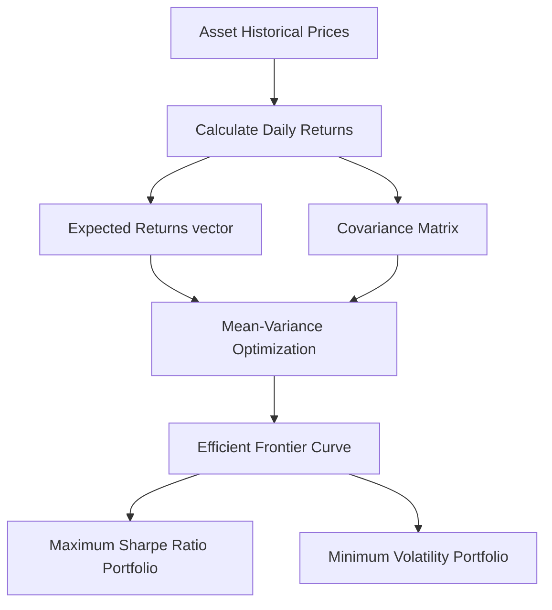

Welcome to a series of articles on Financial Analysis and Portfolio Optimisation. This started off as a series of Facebook and LinkedIn posts that I published whilst playing around with Python to try and optimise our investment portfolio. A friend of mine, Raj Dalal, has encouraged me to convert them into blog posts, so here we are.

## Background

It was the mid to late 1970s. I was 14 years old, and my father was thinking of purchasing some programmable scientific calculators for his office to use, so he brought back home some calculators he was evaluating. I remember playing with the HP-67 and TI-58, and I practiced writing programs for both of them.

One of the calculators came with a "solution book" illustrating example calculations and programs that can be used in various disciplines. One of the solution books was about Financial Analysis and it contained programs for calculating time value of money, bond and option pricing, etc. and that book blew my mind.

Years later I ended up doing a Masters of Applied Finance, one of the subjects I really enjoyed was Investment Theory. The course went through the fundamentals of portfolio management, securities pricing and analysis, and investment management. I always thought this will be very useful when I retired, because I can use the knowledge to manage our investment portfolio.

My first job was calculating the "Greek letters" (alpha, beta, gamma, etc.) of a synthetic options portfolio and transactions required to rebalance the portfolio. I created a way of distributing the calculations (written in C) across a network of Sun workstations.

As my career progressed, however, I moved away from being an analyst, and I stopped having a hands-on role in either finance or computing. I didn't really think that much about personal investing, I was too busy.

I was lucky that when the Great Financial Crisis hit in 2008, I didn't have much invested in equities, so I didn't lose much money. But I realised it was a great opportunity to get into the market. We had an investment property, which we sold and invested the proceeds in a selection of blue-chip high-dividend stocks plus some fixed income.

In hindsight, it proved to be a great move. Our portfolio doubled, then tripled. But I really still didn't have any time to actively manage the portfolio, so it was just accumulating money.

Then, sometime in the mid 2010s, I heard about an algorithmic trading platform called Quantopian. It allowed anyone to develop, test, and use trading algorithms to buy and sell securities using Python. I dreamed of retiring and spending my days trading. There was just one small problem: I hadn't touched coding in years, and wasn't familiar with Python. It was just a bridge too far.

Fast forward to 2021. Our portfolio had performed well 10 years ago, but lately has been underperforming the market and clearly needs rebalancing. In 2020, many companies slashed their dividends, and we didn't earn nearly as much income as previous years. Interest rates have also fallen dramatically over the last 10 years to virtually zero and don't look like they are going up anytime soon.

I spent time learning Python and the `pandas` library. Pandas took a long time to learn, but was surprisingly powerful for manipulating large amounts of financial data.

To my disappointment, Quantopian no longer exists. It closed down in November 2020 after 9 years. It had a bold business model of offering a free platform to users, but tried to make money by crowdsourcing the best trading algorithms and using them to manage a hedge fund. Unfortunately, it turns out that maybe, just maybe, it's not so easy to make above-market returns by algorithmic trading.

That caused me to pause. Does algorithmic trading even work? Maybe, but it seems if it does work it's for a very finite period of time. And all the usual issues with Artificial Intelligence & regression models (over-training, unstable features, multicollinearity, etc) apply.

I had an idea of using dark, alternative data in a multi-factor regression model to pick stocks, but then I discovered many people had exactly the same idea, and if they have been successful, they are keeping very quiet.

However, I still needed to rebalance our portfolio, but to do that I needed to understand it better. So I have decided to persevere with learning Python and using it for financial analysis and portfolio optimisation. Join me in these series of articles as I embark on a journey of learning and discovery.

But before we start, let's go through an overview of what portfolio optimisation is.

---

## Investing vs Speculating

First of all, let's differentiate an investor from a speculator. I would classify a high proportion of people in the market as "speculators" - they buy and sell individual stocks (or ETFs, or real estate, or works of art) based on a variety of reasons (ranging from a "hot tip" they have heard from a friend or social media to even perhaps based on meticulously researched information). They make purchase and sale decisions based on their perception of future performance of individual assets, and not how the assets relate to each other. When we invested in our portfolio more than ten years ago, we were speculators. There is nothing wrong with being a speculator, we all speculate to some extent.

By contrast, an investor is someone who makes decisions based on the portfolio as a whole rather than the performance of individual assets. Portfolio optimisation therefore is the art of holding a basket of assets that complement each other, so that the performance of the portfolio maximises return and minimises risk.

But surely if a speculator picks the best 10 stocks, then the portfolio by definition is optimised? Not necessarily, because if we invested in 10 tech stocks (for example, or 10 banks, or whatever), if something affects the entire industry, all stocks will be similarly affected.

This is where diversification is important. The idea is that asset prices don't all move in the same path - as one stock goes up in price another may fall, particular if it is in a different industry, or in a different geographic region and subject to different economic factors. The idea is that if we invested in a range of stocks, our portfolio will be less "volatile" - the portfolio as a whole doesn't go up and down in price as much as any individual security. We get even more diversification if we invested in a range of assets from different classes: equities, real estate, bonds, whatever.

So we start caring less about the performance and volatility of individual stocks, but more about the overall return and the overall volatility. Ideally we want to choose a set of assets that complement each other, maximising the expected return of the portfolio whilst minimising the risk. This is where Modern Portfolio Theory comes in.

---

## Modern Portfolio Theory (MPT)

Harry Markowitz is generally credited as the "father" of Modern Portfolio Theory in his seminal paper "Portfolio Selection," which was published in the Journal of Finance in 1952. He was later awarded a Nobel Prize in Economics in 1990 for this framework.

The core idea of MPT is simple. If we have a basket of say $N$ assets (which can be anything: a share in a company, a house, a bond, an oil painting) and a fixed sum to invest (say $1m) then how much should we allocate that sum across the assets to maximise return and minimise volatility?

Note that MPT doesn't help you choose the assets, you need to select them beforehand. A common technique these days is to choose a range of ETFs from different asset classes and geographic regions.

We represent our allocation by a vector of weights $\mathbf{w} = [w_1, w_2, \dots, w_N]^T$, where each weight $w_i$ represents the proportion of our capital allocated to asset $i$. These weights must satisfy the budget constraint:

$$\sum_{i=1}^{N} w_i = 1$$

---

## The Mathematics of Risk and Return

To quantitatively model portfolios, MPT relies on statistical estimators computed from historical returns.

### 1. Portfolio Expected Return

The expected return of a portfolio $\mu_p$ is the weighted average of the expected returns of the individual assets:

$$\mu_p = \sum_{i=1}^{N} w_i \mu_i = \mathbf{w}^T \boldsymbol{\mu}$$

Where $\boldsymbol{\mu} = [\mu_1, \mu_2, \dots, \mu_N]^T$ is the vector of expected returns for each asset.

### 2. Portfolio Risk (Variance and Volatility)

Risk in MPT is quantified as the variance of portfolio returns $\sigma_p^2$. Because assets behave dependently, this calculation incorporates both the variance of individual assets and their mutual covariances. Using the covariance matrix $\Sigma$:

$$\sigma_p^2 = \sum_{i=1}^{N} \sum_{j=1}^{N} w_i w_j \sigma_{ij} = \mathbf{w}^T \Sigma \mathbf{w}$$

Where $\sigma_{ij}$ is the covariance between asset $i$ and asset $j$ (and $\sigma_{ii} = \sigma_i^2$ is the variance of asset $i$). The portfolio standard deviation (volatility) is simply $\sigma_p = \sqrt{\mathbf{w}^T \Sigma \mathbf{w}}$.

### 3. The Sharpe Ratio

To measure risk-adjusted performance, William F. Sharpe introduced the Sharpe Ratio, which calculates the excess return per unit of volatility:

$$\text{Sharpe Ratio} = \frac{\mu_p - R_f}{\sigma_p}$$

Where $R_f$ is the risk-free rate of return (such as government bonds).

---

## The Efficient Frontier

Markowitz proved that by solving a quadratic programming problem, we can find a specific set of weights that minimizes portfolio variance for a target expected return, or conversely, maximizes expected return for a target variance:

$$\min_{\mathbf{w}} \mathbf{w}^T \Sigma \mathbf{w} \quad \text{subject to} \quad \mathbf{w}^T \boldsymbol{\mu} = \mu_{\text{target}} \quad \text{and} \quad \mathbf{w}^T \mathbf{1} = 1$$

Plotting these optimal portfolios in a risk-return space generates the **Efficient Frontier**. Any portfolio situated on this upper boundary offers the maximum possible return for that specific level of risk.



---

## Implementing MPT in Python

Using modern libraries like `pandas`, `numpy`, and `scipy.optimize`, we can construct the efficient frontier and locate optimal allocations. Here is a practical walkthrough of the implementation.

### Step 1: Compute Returns and Covariances

Assuming we have historical daily closing prices in a pandas DataFrame:

```python
import numpy as np
import pandas as pd

# Let's say 'df' is a DataFrame containing historical closing prices of assets
# Calculate daily returns
returns = df.pct_change().dropna()

# Annualise the expected daily returns (using 252 trading days)
expected_returns = returns.mean() * 252

# Annualise the covariance matrix
cov_matrix = returns.cov() * 252
```

### Step 2: Monte Carlo Simulation of Portfolios

To visualize the frontier, we can simulate thousands of random asset allocations:

```python
num_portfolios = 10000
results = np.zeros((3, num_portfolios))
weights_record = []

for i in range(num_portfolios):
    # Generate random weights
    weights = np.random.random(len(df.columns))
    weights /= np.sum(weights) # Normalise to sum to 1.0
    weights_record.append(weights)

    # Portfolio expected return
    p_return = np.dot(weights, expected_returns)
    # Portfolio expected volatility
    p_volatility = np.sqrt(np.dot(weights.T, np.dot(cov_matrix, weights)))

    # Store results
    results[0, i] = p_return
    results[1, i] = p_volatility
    # Sharpe Ratio (assuming risk-free rate of 1%)
    results[2, i] = (p_return - 0.01) / p_volatility
```

### Step 3: Finding the Optimal Portfolios

Using optimization algorithms, we can identify the exact weights for two critical portfolios on the frontier:

1.  **Maximum Sharpe Ratio (Tangency Portfolio):** The portfolio that maximizes risk-adjusted returns.
2.  **Minimum Variance Portfolio:** The portfolio with the lowest possible volatility.

```python
from scipy.optimize import minimize

# Define functions to minimize
def portfolio_volatility(weights):
    return np.sqrt(np.dot(weights.T, np.dot(cov_matrix, weights)))

def negative_sharpe_ratio(weights, risk_free_rate=0.01):
    p_return = np.dot(weights, expected_returns)
    p_vol = portfolio_volatility(weights)
    return -(p_return - risk_free_rate) / p_vol

# Constraints: weights sum to 1.0
constraints = ({'type': 'eq', 'fun': lambda x: np.sum(x) - 1})
# Bounds: weights between 0 and 1 (no short selling)
bounds = tuple((0, 1) for _ in range(len(df.columns)))
initial_weights = [1.0 / len(df.columns)] * len(df.columns)

# 1. Max Sharpe Ratio
opt_sharpe = minimize(negative_sharpe_ratio, initial_weights, method='SLSQP', bounds=bounds, constraints=constraints)
max_sharpe_weights = opt_sharpe.x

# 2. Min Volatility
opt_vol = minimize(portfolio_volatility, initial_weights, method='SLSQP', bounds=bounds, constraints=constraints)
min_vol_weights = opt_vol.x
```

---

## Conclusion

Modern Portfolio Theory provided the mathematical framework that proved diversification is not just an intuitive strategy, but a quantitative law. In the next part of this series, we will fetch live historical market data using the `yfinance` library and apply these calculations to a real basket of ETFs to construct our own Efficient Frontier.

---

## References

1. Markowitz, H. (1952). "Portfolio Selection." _The Journal of Finance_, 7(1), 77-91. [doi:10.1111/j.1540-6261.1952.tb01525.x](https://doi.org/10.1111/j.1540-6261.1952.tb01525.x)
2. Sharpe, W. F. (1966). "Mutual Fund Performance." _Journal of Business_, 39(1), 119-138. [doi:10.1086/294846](https://doi.org/10.1086/294846)
3. McKinney, W. (2010). "Data Structures for Statistical Computing in Python." _Proceedings of the 9th Python in Science Conference_, 51-56.
4. Virtanen, P. et al. (2020). "SciPy 1.0: Fundamental Algorithms for Scientific Computing in Python." _Nature Methods_, 17, 261–272. [doi:10.1038/s41592-020-0772-5](https://doi.org/10.1038/s41592-020-0772-5)
